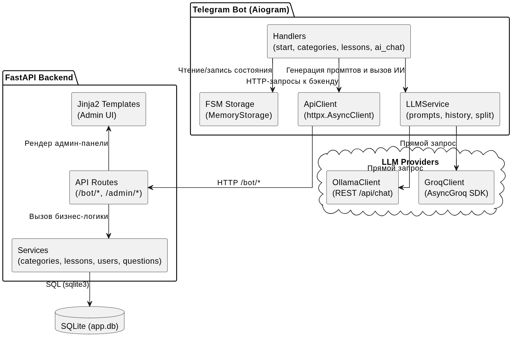
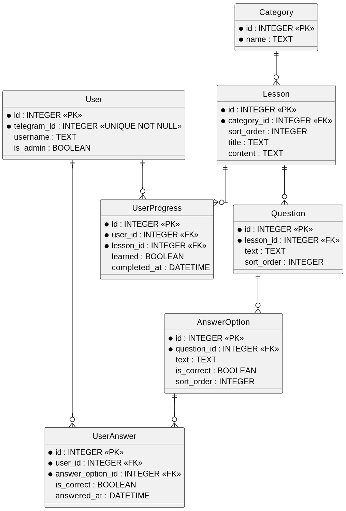
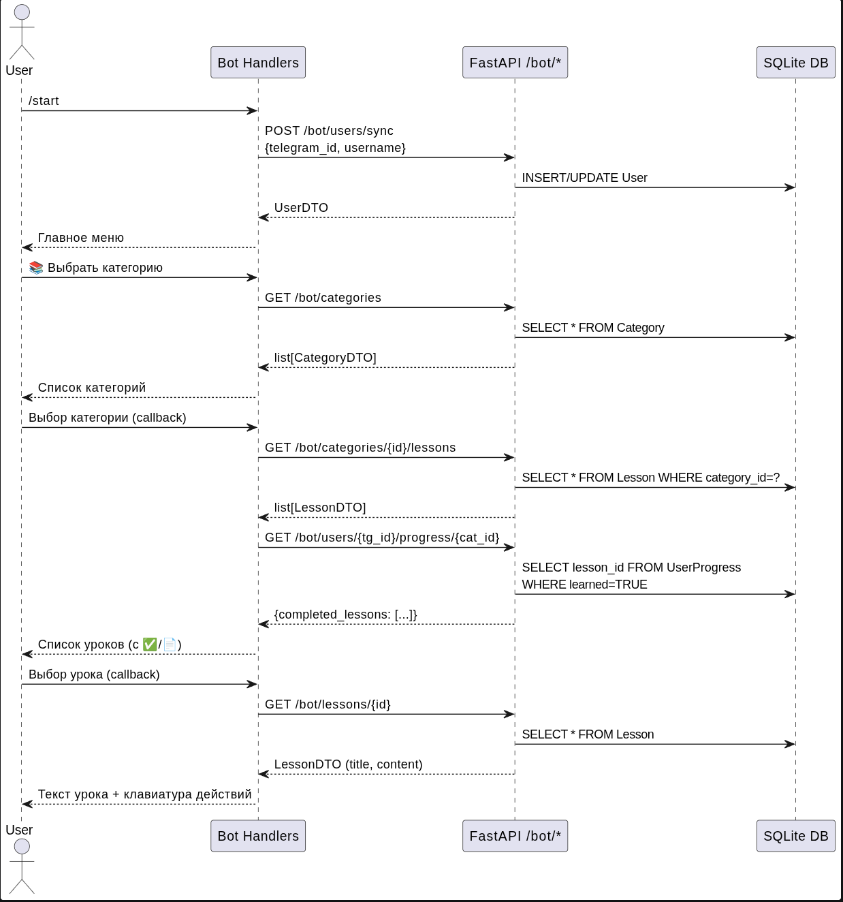

# Python Learning Bot

Telegram-бот для обучения Python с уроками, тестами и ИИ-помощником (Ollama/Groq).  
Веб-админка для управления контентом и просмотра прогресса.

## Возможности

- **Обучение** — категории → уроки (HTML‑формат) → тест (один вопрос после урока)
- **Telegram‑бот** — меню, выбор курса, прохождение уроков, тесты, диалог с ИИ
- **ИИ‑помощник** — подбор категории, разбор ошибок из теста, собеседование по теме
- **Админ‑панель** — CRUD категорий/уроков/вопросов, просмотр прогресса и ответов пользователей

## Архитектура (диаграммы)

Компоненты системы и их взаимодействие:



Схема базы данных (SQLite):



Пример последовательности запросов (User → Bot → API → DB):



## Быстрый старт

1. Установите зависимости:
   ```bash
   pip install -r requirements.txt
   ```

2. Создайте файл `.env`:
   ```
   BOT_TOKEN=ваш_токен_бота
   API_BASE_URL=http://localhost:8000
   LLM_PROVIDER=groq        # или ollama
   LLM_MODEL=llama3-8b-8192
   GROQ_API_KEY=...         # для groq
   OLLAMA_BASE_URL=http://localhost:11434
   ```

3. Запустите сервер (FastAPI + админка):
   ```bash
   uvicorn main:app --reload
   ```

4. В отдельном терминале запустите бота:
   ```bash
   python -m app.bot.run_bot
   ```

Админ-панель: `http://localhost:8000/admin/ui/`

## База данных

SQLite создаётся автоматически. Начальные данные (категории, уроки, тесты) загружаются из `schema.sql`.

---

Теперь README содержит не только инструкции, но и наглядные схемы, помогающие понять устройство проекта.

Главное — запустил и работает. Остальное по мере необходимости.


